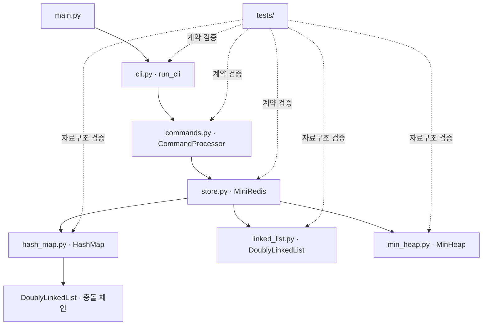
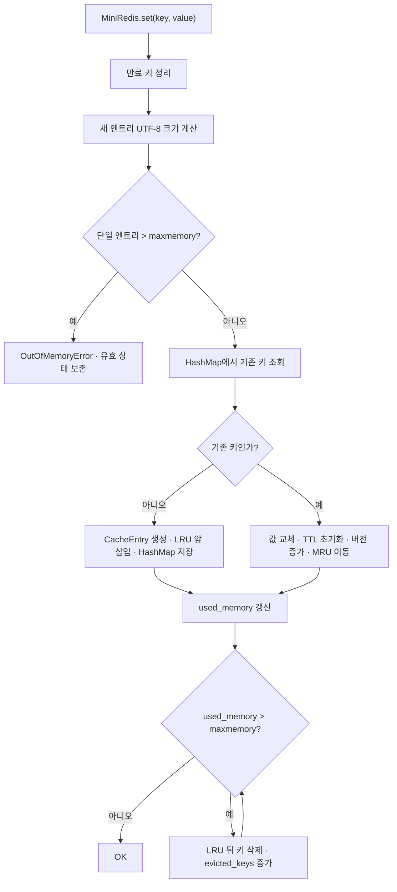
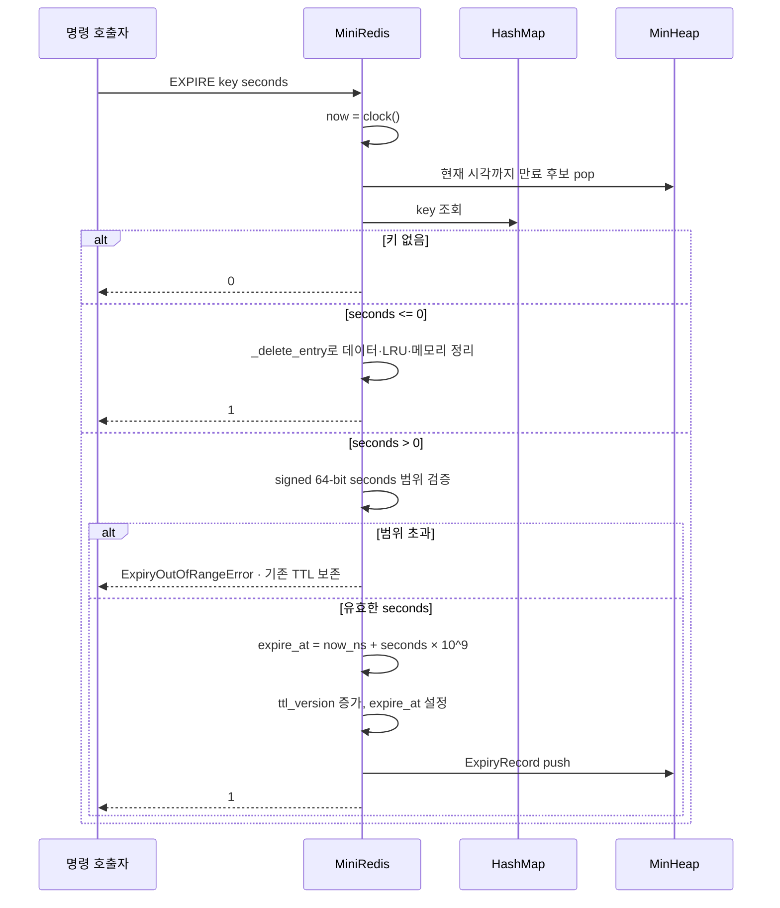

# Mini Redis 코드 분석 가이드

이 문서는 Python 기본 문법을 알고 있는 학습자가 Mini Redis 구현을 스스로 분석할 수 있도록 돕는 안내서다. 기능 요구사항을 다시 나열하기보다, **어떤 지식을 가지고 어떤 순서로 코드를 읽어야 하는지**, 그리고 **여러 자료구조가 어떻게 하나의 일관된 저장소를 만드는지**에 초점을 맞춘다.

함께 보면 좋은 문서는 다음과 같다.

- [과제 원문](subject.md): 무엇을 구현해야 하는지 확인할 때 사용한다.
- [기술 명세](spec.md): 명령 계약과 구현 결정을 정확히 확인할 때 사용한다.
- [README](../README.md): 실행 방법과 프로젝트 개요를 빠르게 확인할 때 사용한다.

## 1. 코드를 읽기 전에 알아둘 것

### 1.1 시간 복잡도

이 프로젝트의 핵심 질문은 단순히 "동작하는가?"가 아니라 "왜 빠르게 동작하는가?"다. 따라서 다음 표기부터 익숙해야 한다.

| 표기 | 의미 | 이 프로젝트의 예 |
| --- | --- | --- |
| O(1) | 데이터 수와 관계없이 일정한 단계 | 알고 있는 연결 리스트 노드 삭제, 힙의 최솟값 조회 |
| O(log n) | 데이터가 늘어도 증가 폭이 작음 | 최소 힙의 `push`, `pop` |
| O(n) | 데이터 수에 비례 | 해시 충돌 체인 전체 탐색, 전체 키 순회 |
| 평균 O(1) | 보통은 일정하지만 최악에는 느려질 수 있음 | 해시맵의 `get`, `put`, `remove` |

해시맵 연산을 무조건 O(1)이라고 단정하면 안 된다. 키가 고르게 분산된다는 전제에서는 평균 O(1)이지만, 모든 키가 한 버킷에 몰리면 연결 리스트를 끝까지 확인해야 하므로 최악 O(n)이다.

### 1.2 객체 참조와 동일성

Python 변수는 객체 자체가 아니라 객체를 가리키는 참조를 가진다. 이 구현에서는 하나의 `CacheEntry` 객체를 해시맵과 LRU 리스트가 함께 참조한다.

```text
HashMap: key ───────┐
                    ▼
                CacheEntry
                    ▲
LRU Node.data ──────┘
```

값을 복사해 두 곳에 별도로 저장하는 방식이 아니다. 따라서 `CacheEntry.value`나 `CacheEntry.expire_at`을 변경하면 해시맵을 통해 조회하든 LRU 노드를 통해 접근하든 동일한 최신 상태를 보게 된다.

이 구조가 중요한 이유는 다음 두 가지다.

- 해시맵으로 키를 평균 O(1)에 찾을 수 있다.
- 찾은 엔트리의 `lru_node` 참조를 이용해 LRU 위치도 O(1)에 바꿀 수 있다.

### 1.3 이중 연결 리스트와 sentinel

이중 연결 리스트 노드는 이전 노드 `prev`, 다음 노드 `next`, 실제 데이터 `data`를 가진다.

```text
None ← [A] ⇄ [B] ⇄ [C] → None
```

이 프로젝트의 [`DoublyLinkedList`](../mini_redis/linked_list.py)는 실제 첫 노드와 마지막 노드를 직접 특별 취급하지 않도록 head/tail sentinel을 둔다.

```text
[HEAD] ⇄ [A] ⇄ [B] ⇄ [C] ⇄ [TAIL]
```

sentinel은 경계만 표시하며 사용자 데이터를 저장하지 않는다. 빈 리스트도 항상 `HEAD.next == TAIL`, `TAIL.prev == HEAD`라는 동일한 모양을 유지한다. 덕분에 삽입과 삭제 코드에서 "첫 노드인가?", "마지막 노드인가?"를 반복해서 분기할 필요가 없다.

노드 위치를 이미 알고 있다면 삭제할 노드를 찾기 위한 순회가 필요 없다. 주변 네 개의 링크만 바꾸면 되므로 `remove_node`와 `move_to_front`는 O(1)이다.

### 1.4 해시, 버킷, 체이닝, 로드 팩터

해시맵은 문자열 키를 해시 정수로 바꾼 뒤 버킷 인덱스를 계산한다.

```text
문자열 키 → 해시 함수 → 큰 정수 → 나머지 연산 → 버킷 인덱스
```

서로 다른 키가 같은 버킷 인덱스를 얻는 현상을 충돌이라고 한다. [`HashMap`](../mini_redis/hash_map.py)은 한 버킷에 여러 `HashEntry`를 이중 연결 리스트로 연결하는 체이닝 방식으로 충돌을 해결한다.

```text
bucket[0] → None
bucket[1] → [key-a] ⇄ [key-z]
bucket[2] → [key-b]
```

해시 함수는 문자열의 UTF-8 바이트를 입력으로 하는 64-bit FNV-1a다. 각 바이트를 XOR하고 소수를 곱하는 과정을 반복한다. 같은 문자열은 항상 같은 해시를 만들지만, 최종 버킷은 현재 버킷 수에 대한 나머지로 결정된다.

로드 팩터는 다음 비율이다.

```text
load factor = 저장된 엔트리 수 / 버킷 수
```

이 값이 너무 커지면 한 버킷의 충돌 체인이 길어질 가능성이 높아진다. 새 키 삽입으로 로드 팩터가 0.75를 초과할 예정이면 버킷 수를 2배로 늘리고 모든 키를 새 버킷 수에 맞춰 다시 배치한다. 이를 재해시라고 한다.

### 1.5 최소 힙

최소 힙은 부모가 자식보다 작거나 같은 완전 이진 트리다. 배열로 표현할 때 인덱스 관계는 다음과 같다.

```text
parent(i) = (i - 1) // 2
left(i)   = 2 * i + 1
right(i)  = 2 * i + 2
```

[`MinHeap`](../mini_redis/min_heap.py)은 새 값을 배열 끝에 넣고 `_heapify_up`으로 올리거나, 루트를 제거한 뒤 마지막 값을 루트에 놓고 `_heapify_down`으로 내린다.

- 최솟값 확인 `peek`: O(1)
- 삽입 `push`: O(log n)
- 최솟값 제거 `pop`: O(log n)

TTL에서는 가장 이른 만료 시각만 빠르게 찾으면 되므로 최소 힙이 잘 맞는다.

### 1.6 LRU

LRU(Least Recently Used)는 가장 오랫동안 사용되지 않은 데이터를 먼저 제거하는 정책이다. 이 구현은 LRU 리스트의 방향을 다음처럼 정한다.

```text
HEAD ⇄ [가장 최근 사용, MRU] ⇄ ... ⇄ [가장 오래됨, LRU] ⇄ TAIL
```

- 성공한 `SET`: 해당 키를 맨 앞으로 이동
- 성공한 `GET`: 해당 키를 맨 앞으로 이동
- 메모리 초과: 맨 뒤 키부터 제거

`EXISTS`, `TTL`, `KEYS`처럼 값을 실제로 사용하지 않는 명령은 LRU 순서를 바꾸지 않는다.

### 1.7 TTL과 lazy deletion

TTL(Time To Live)은 키가 얼마나 더 살아 있을지를 나타낸다. 키마다 만료 시각을 두고, 가장 빠른 만료 시각을 힙의 루트에서 확인한다.

문제는 `EXPIRE`를 다시 호출하거나 `DEL`, `SET` 덮어쓰기를 수행했을 때 생긴다. 최소 힙은 루트 제거에는 강하지만, 중간에 있는 특정 키 레코드를 찾아 지우는 데는 O(n)이 필요하다.

이 구현은 오래된 힙 레코드를 즉시 찾아 삭제하지 않는다. 대신 `ttl_version`을 증가시켜 현재 엔트리와 버전이 맞지 않는 레코드를 나중에 무시한다. 이것이 lazy deletion이다.

```text
오래된 레코드: (expire_at=110, version=1, key="a")
현재 엔트리:   (expire_at=130, version=2, key="a")

버전 또는 만료 시각 불일치 → 오래된 레코드를 무시
```

힙 크기는 살아 있는 키 수보다 커질 수 있다는 점에 주의한다. 반복해서 TTL을 바꾸면 stale 레코드가 자신의 만료 시각에 도달할 때까지 힙에 남는다.

### 1.8 단조 시계

TTL 계산에는 [`time.monotonic_ns`](../mini_redis/store.py)을 사용한다. 일반적인 현재 시각은 운영체제 시간 보정으로 앞뒤로 바뀔 수 있지만, 단조 시계는 실행 중 뒤로 가지 않으므로 "얼마나 지났는가"를 계산하기 적합하다. 나노초 정수를 사용하면 매우 큰 TTL에서도 부동소수점 정밀도 손실 없이 초 단위 차이를 보존할 수 있다.

`MiniRedis` 생성자는 초 단위 시계 함수를 주입받을 수 있다. 실제 실행에서는 `time.monotonic_ns`를 직접 사용하고, 주입된 `FakeClock` 값은 내부에서 나노초 정수로 바꾼다. 덕분에 테스트는 원하는 만큼 즉시 시간을 이동하면서 실제 코드와 같은 정수 기반 TTL 계산을 사용한다.

### 1.9 UTF-8 바이트와 문자열 길이

메모리 사용량은 Python 문자열의 글자 수가 아니라 UTF-8 바이트 수로 계산한다.

```python
len("a")                 # 1
len("a".encode("utf-8"))  # 1

len("한")                 # 1
len("한".encode("utf-8"))  # 3
```

따라서 한글 키와 값을 테스트할 때 `len(key) + len(value)`로 예상값을 계산하면 틀릴 수 있다. 실제 공식은 다음과 같다.

```text
used_memory = Σ(len(key.encode("utf-8")) + len(value.encode("utf-8")))
```

### 1.10 REPL, `shlex`, 테스트 대역

REPL(Read-Eval-Print Loop)은 프롬프트를 출력하고, 한 줄을 읽고, 실행 결과를 출력하는 과정을 반복한다. [`run_cli`](../mini_redis/cli.py)는 입출력 스트림을 주입받을 수 있어 실제 터미널뿐 아니라 `StringIO`로도 테스트할 수 있다.

[`CommandProcessor.execute`](../mini_redis/commands.py)는 `shlex.split`으로 입력을 토큰화한다. 이 덕분에 다음 두 입력을 모두 처리할 수 있다.

```text
SET name Alice
SET greeting "Hello World"
```

닫히지 않은 따옴표는 `shlex`가 `ValueError`를 발생시키며, 명령 처리기는 이를 Redis 스타일 syntax error로 바꾼다.

## 2. 전체 구조



레이어별 책임은 다음과 같다.

| 계층 | 책임 | 몰라도 되는 것 |
| --- | --- | --- |
| `main.py` | CLI 시작 | 저장 방식 |
| `cli.py` | 프롬프트, 입력, 출력, 종료 | 명령별 세부 동작 |
| `commands.py` | 파싱, 인자 검증, 결과 포맷 | LRU와 TTL 내부 구조 |
| `store.py` | 데이터·LRU·TTL·메모리 일관성 | 프롬프트 출력 방식 |
| 자료구조 모듈 | 연결, 해시, 힙 연산 | Redis 명령 문자열 |
| `tests/` | 각 계층의 계약 증명 | 실제 사용자 입력 |

`MiniRedis`가 세 자료구조를 조정하는 중심 역할을 한다.

| 내부 상태 | 역할 |
| --- | --- |
| `_data: HashMap` | 키로 `CacheEntry`를 찾는다. |
| `_lru: DoublyLinkedList` | 최근 사용 순서를 추적한다. |
| `_expiry_heap: MinHeap` | 가장 빠른 TTL 만료 후보를 찾는다. |
| `_used_memory` | 현재 키·값의 UTF-8 바이트 합이다. |
| `_maxmemory` | 0이면 무제한, 양수면 메모리 제한이다. |
| `_evicted_keys` | LRU 정책으로 제거된 키 수다. |

`CacheEntry`는 하나의 키에 관한 현재 상태를 모은다.

| 필드 | 의미 |
| --- | --- |
| `key` | 해시맵 키와 동일한 문자열 |
| `value` | 저장된 문자열 값 |
| `lru_node` | 이 엔트리를 담은 LRU 노드 참조 |
| `expire_at` | 단조 시계 기준 만료 나노초, TTL이 없으면 `None` |
| `ttl_version` | TTL 레코드의 최신 여부를 판별하는 버전 |

`ExpiryRecord`는 `expire_at`, `ttl_version`, `key` 순서로 비교된다. 따라서 만료 시각이 가장 작은 레코드가 힙 루트로 올라온다.

## 3. 권장 코드 읽기 순서

처음부터 자료구조의 세부 포인터를 따라가기보다 사용자 입력이 저장소에 도달하는 경로를 먼저 잡는 편이 이해하기 쉽다.

### 3.1 `main.py`

프로그램의 시작점이다. `run_cli()`를 호출한다는 사실만 확인한다. 이 파일에서는 Redis 동작을 분석할 필요가 없다.

### 3.2 [`mini_redis/cli.py`](../mini_redis/cli.py)

`run_cli`의 반복문을 읽는다.

1. `mini-redis> ` 프롬프트 출력
2. 한 줄 입력
3. `CommandProcessor.execute` 호출
4. 결과가 있으면 출력
5. EOF, `KeyboardInterrupt`, `exit`, `quit`이면 종료

입출력 스트림을 매개변수로 받는 이유를 [`tests/test_cli.py`](../tests/test_cli.py)와 함께 확인한다.

### 3.3 [`mini_redis/commands.py`](../mini_redis/commands.py)

`CommandProcessor.execute`부터 읽는다.

- `shlex.split`이 사용자 문자열을 토큰으로 바꾼다.
- 첫 토큰만 대문자로 바꿔 명령 이름을 비교한다.
- 키와 값은 원래 대소문자를 보존한다.
- 각 `_set`, `_get` 같은 메서드가 인자 수를 검사하고 저장소를 호출한다.
- 저장소 반환값과 예외를 Redis 스타일 문자열로 변환한다.
- 반환 tuple의 두 번째 값 `should_exit`이 REPL 종료 여부를 전달한다.

여기서는 LRU나 TTL을 직접 다루지 않는다는 점이 중요하다. 명령 계층은 입력과 출력 계약에 집중하고 상태 일관성은 저장소에 맡긴다.

### 3.4 [`mini_redis/store.py`](../mini_redis/store.py)

가장 중요한 파일이다. 다음 순서로 읽는다.

1. `CacheEntry`, `ExpiryRecord`, `MemoryInfo`, `ExpiryOutOfRangeError`
2. `MiniRedis.__init__`의 내부 상태
3. 공개 동작 `set`, `get`, `delete`, `exists`, `dbsize`, `keys`
4. TTL 동작 `expire`, `ttl`
5. 메모리 동작 `config_set_maxmemory`, `info_memory`
6. 공통 내부 동작 `_purge_expired`, `_evict_to_limit`, `_delete_entry`

공개 메서드를 읽을 때는 "어떤 자료구조가 바뀌는가?", "메모리 카운터도 같이 바뀌는가?", "LRU 순서는 바뀌는가?"를 계속 확인한다.

### 3.5 자료구조 모듈

저장소의 흐름을 이해한 다음 내부 구현을 내려가며 읽는다.

1. [`linked_list.py`](../mini_redis/linked_list.py): sentinel과 O(1) 이동
2. [`hash_map.py`](../mini_redis/hash_map.py): 체이닝과 재해시
3. [`min_heap.py`](../mini_redis/min_heap.py): heapify

이 순서가 좋은 이유는 해시맵도 충돌 체인에 `DoublyLinkedList`를 재사용하기 때문이다.

### 3.6 테스트

마지막에는 테스트를 요구사항의 실행 가능한 문서처럼 읽는다. 테스트 이름만 훑어도 어떤 엣지 케이스가 중요하게 취급되는지 알 수 있다.

## 4. 모듈별 분석 포인트

### 4.1 `Node`와 `DoublyLinkedList`

`Node.__slots__`에는 `prev`, `next`, `data`, `_owner`가 있다. `_owner`는 노드가 어느 리스트에 속하는지 확인한다.

`remove_node`와 `move_to_front`는 먼저 `_validate_node`를 호출한다. 다른 리스트의 노드나 이미 제거된 노드를 받으면 `ValueError`를 발생시킨다. 제거할 때는 `prev`, `next`, `_owner`를 `None`으로 바꿔 노드가 더 이상 연결되어 있지 않음을 명확히 한다.

분석할 때 확인할 불변식은 다음과 같다.

- `_head.prev`와 `_tail.next`는 사용하지 않는다.
- `_head.next`에서 시작해 계속 `next`를 따라가면 `_tail`에 도달한다.
- `_tail.prev`에서 시작해 계속 `prev`를 따라가면 `_head`에 도달한다.
- 실제 노드 수와 `_size`가 같다.
- 리스트에 연결된 실제 노드의 `_owner`는 해당 리스트다.

`iter_nodes`가 `yield` 전에 `following = current.next`를 저장하는 점도 살펴본다. 순회 중 현재 노드를 제거하더라도 다음 노드 참조를 잃지 않도록 한 패턴이다.

### 4.2 `HashEntry`와 `HashMap`

버킷 배열 `_buckets`의 각 칸은 `None` 또는 `DoublyLinkedList`다. 빈 버킷에는 리스트 객체조차 만들지 않고, 첫 엔트리가 들어올 때 생성한다. 마지막 엔트리가 제거되면 다시 `None`으로 돌린다.

`put`은 먼저 기존 키를 찾는다.

- 기존 키: 값만 교체하고 크기는 바뀌지 않는다.
- 새 키: 예상 로드 팩터를 계산하고 필요하면 먼저 확장한다.

확장할 때 `_resize`는 새 버킷 배열을 만들고 `_insert_without_resize`로 모든 엔트리를 다시 배치한다. 기존 버킷 인덱스를 그대로 복사할 수 없는 이유는 버킷 수가 달라지면 `hash % capacity` 결과도 달라지기 때문이다.

`HashMap`은 값으로 `None`을 허용하지 않는다. `get`이 "없는 키"를 `None`으로 표현하므로 실제 값까지 `None`을 허용하면 두 상태를 구분할 수 없기 때문이다.

### 4.3 `MinHeap`

`push`는 배열 끝에 값을 추가한 뒤 부모와 비교하며 올라간다. `pop`은 다음 순서다.

1. 비어 있으면 `None`
2. 하나뿐이면 마지막 값 제거
3. 루트를 반환값으로 보관
4. 마지막 값을 루트로 이동
5. 더 작은 자식과 자리를 바꾸며 내려감

`_heapify_down`에서 왼쪽과 오른쪽 자식 중 더 작은 쪽을 선택하는지 확인한다. 한쪽 자식만 존재할 수 있으므로 배열 범위 검사 순서도 중요하다.

힙은 `ExpiryRecord`를 특별히 알지 못한다. 단지 저장된 객체의 `<` 비교 결과만 사용한다. TTL 정렬 규칙은 `ExpiryRecord.__lt__`가 제공한다.

### 4.4 `MiniRedis`

`MiniRedis`를 분석할 때 한 명령이 여러 상태를 동시에 바꾼다는 점을 놓치면 안 된다. 예를 들어 키 삭제는 해시맵에서만 제거하는 것으로 끝나지 않는다.

```text
키 삭제
├── HashMap 엔트리 제거
├── LRU 노드 제거
├── used_memory 차감
├── expire_at 초기화
└── ttl_version 증가
```

이 공통 로직을 `_delete_entry`에 모아 두었기 때문에 `DEL`, TTL 만료, LRU 제거가 같은 정리 절차를 공유한다.

### 4.5 `CommandProcessor`

명령 이름은 대소문자를 구분하지 않지만 데이터는 구분한다.

```text
sEt Mixed Value  → 명령은 SET으로 인식, 키는 "Mixed" 유지
GET Mixed        → 값 존재
GET mixed        → 다른 키이므로 (nil)
```

오류가 어느 계층에서 만들어지는지도 구분한다.

| 오류 | 발생 위치 |
| --- | --- |
| 닫히지 않은 따옴표 | `shlex.split` 예외를 `execute`가 변환 |
| 알 수 없는 명령 | `execute`의 마지막 분기 |
| 잘못된 인자 수 | 명령별 메서드 |
| 정수가 아닌 값 | `_parse_integer` 결과 검사 |
| 단일 엔트리 메모리 초과 | 저장소의 `OutOfMemoryError`를 `_set`이 변환 |
| 표현할 수 없는 만료 시각 | 저장소의 `ExpiryOutOfRangeError`를 `_expire`가 정수 범위 오류로 변환 |

`quote_string`은 역슬래시를 먼저 이스케이프하고 큰따옴표를 이스케이프한다. 순서를 반대로 바꾸면 새로 추가한 역슬래시까지 다시 처리할 수 있으므로 현재 순서에 의미가 있다.

### 4.6 `run_cli`

CLI는 `CommandProcessor` 객체, 입력 스트림, 출력 스트림을 주입받을 수 있다. 기본값은 각각 새 명령 처리기, `sys.stdin`, `sys.stdout`이다.

이 설계 덕분에 동일한 반복문을 두 환경에서 사용한다.

- 실제 실행: 터미널 입력과 출력
- 테스트: `StringIO` 입력과 출력

`main.py`를 subprocess로 실행하는 테스트도 있으므로 함수 수준 테스트와 실제 프로세스 수준 테스트가 모두 존재한다.

## 5. 핵심 실행 흐름

### 5.1 `SET`: 신규 저장, 덮어쓰기, OOM, LRU 제거



#### 단일 엔트리 OOM이 원자적인 이유

결과 엔트리 하나의 크기가 제한보다 크면 기존 키를 조회하거나 값을 바꾸기 전에 예외가 발생한다. 따라서 기존 유효 데이터, TTL, LRU 순서, 메모리 카운터는 바뀌지 않는다.

단, 모든 저장소 명령과 마찬가지로 `SET` 시작 시 이미 만료된 키는 먼저 정리된다. "원자적"이라는 말은 만료 정리 이후의 유효 상태를 OOM 때문에 훼손하지 않는다는 의미다.

#### 덮어쓰기에서 확인할 것

- 이전 엔트리 크기를 구한다.
- 값을 교체한다.
- 기존 TTL을 `None`으로 초기화한다.
- `ttl_version`을 증가시켜 옛 힙 레코드를 무효화한다.
- LRU 노드를 맨 앞으로 이동한다.
- `used_memory`에는 새 크기와 이전 크기의 차이만 반영한다.

#### 다중 제거가 가능한 이유

한 번의 `SET`으로 제한을 크게 넘을 수 있으므로 `_evict_to_limit`은 `if`가 아니라 `while`을 사용한다. 제한 이하가 될 때까지 LRU 키를 여러 개 제거한다.

### 5.2 `GET`: 성공한 조회만 LRU 갱신

```text
GET key
  → 만료 키 정리
  → HashMap 조회
      → 없음: None 반환, LRU 변경 없음
      → 있음: 해당 lru_node를 앞으로 이동, value 반환
```

만료된 키는 조회 전에 삭제되므로 실패한 `GET`처럼 보인다. 삭제된 노드를 LRU 앞으로 이동하면 안 되기 때문에 키 존재 여부를 확인한 뒤에만 `move_to_front`를 호출한다.

`EXISTS`는 키가 있는지만 확인하며 LRU를 갱신하지 않는다. [`test_get_updates_lru_but_exists_does_not`](../tests/test_store.py)가 두 동작의 차이를 검증한다.

### 5.3 `EXPIRE`, `TTL`, `_purge_expired`



seconds 범위 검증은 `ttl_version`이나 `expire_at`을 바꾸기 전에 끝난다. signed 64-bit 범위를 벗어나면 기존 TTL과 힙 레코드는 그대로 유효하며, 명령 계층은 `ExpiryOutOfRangeError`를 `(error) ERR value is not an integer or out of range`로 바꾼다. 유효한 값은 정수 나노초로 계산하므로 `2**53`보다 큰 초도 범위 안에서는 정확히 보존된다.

`_purge_expired(now)`는 힙 루트의 `expire_at <= now`인 동안 반복한다.

1. 힙에서 가장 이른 레코드를 꺼낸다.
2. 현재 해시맵에서 같은 키를 찾는다.
3. 현재 엔트리의 `expire_at`과 `ttl_version`이 레코드와 모두 같은지 확인한다.
4. 둘 다 같으면 실제 만료이므로 `_delete_entry`를 호출한다.
5. 다르면 stale 레코드이므로 아무 데이터도 삭제하지 않는다.

`TTL`은 다음 값을 구분한다.

| 상태 | 반환 |
| --- | --- |
| 키 없음 또는 이미 만료됨 | `-2` |
| 키는 있으나 TTL 없음 | `-1` |
| TTL 있음 | 남은 초를 내림한 정수 |

만료까지 0.2초가 남았다면 `int(0.2)`는 0이므로 `TTL`은 0을 반환할 수 있다. 만료 시각에 도달하면 명령 앞의 정리 과정에서 키가 삭제되어 -2가 된다.

### 5.4 `DEL`

`delete`는 만료 정리 후 키를 찾고 `_delete_entry`를 호출한다. 힙 중간에 남은 TTL 레코드는 직접 제거하지 않는다. 삭제된 엔트리의 버전과 만료 상태가 달라지므로 나중에 stale 레코드로 무시된다.

`DEL`, TTL 만료, LRU 제거는 모두 `_delete_entry`를 사용하지만 `evicted_keys` 증가는 `_evict_to_limit`에만 있다. 따라서 명시적 삭제와 자연 만료는 퇴출 통계에 포함되지 않는다.

### 5.5 `CONFIG SET maxmemory`

`maxmemory`가 0이면 무제한이다. 양수 제한을 현재 `used_memory`보다 작게 설정해도 즉시 키를 제거하지 않는다.

```text
현재 used_memory = 100
CONFIG SET maxmemory 20
  → used_memory는 아직 100

다음 성공 가능한 SET
  → 새 값 반영
  → used_memory <= 20이 될 때까지 LRU 제거
```

제한을 낮춘 뒤 시도한 `SET`의 단일 엔트리 자체가 너무 크면 OOM이 먼저 발생하므로 기존 초과 상태를 강제로 정리하지 않는다. 실제 제거는 저장 가능한 `SET`이 성공하는 과정에서 수행된다.

### 5.6 관찰 명령과 만료 정리

`DBSIZE`, `KEYS`, `INFO memory`도 먼저 만료 힙을 정리한다. 그렇지 않으면 이미 만료된 키가 개수, 목록, 메모리 사용량에 계속 포함되는 문제가 생긴다.

이 명령들은 상태를 관찰하지만 LRU 순서는 바꾸지 않는다.

## 6. 반드시 유지해야 하는 상태 불변식

불변식은 공개 메서드가 끝났을 때 항상 참이어야 하는 조건이다. 버그를 찾을 때는 출력만 보지 말고 다음 조건이 깨졌는지 확인한다.

| 불변식 | 깨졌을 때 나타날 수 있는 문제 |
| --- | --- |
| 해시맵 엔트리 수와 LRU 실제 노드 수가 같다. | 존재하지만 제거할 수 없는 키, 유령 LRU 노드 |
| 모든 `CacheEntry.lru_node.data`는 그 엔트리 자신이다. | 다른 키의 LRU 순서가 바뀜 |
| 연결된 LRU 노드는 정확히 하나의 리스트에 속한다. | 중복 연결, 크기 불일치 |
| `_used_memory`는 현재 키·값의 UTF-8 바이트 합이다. | 너무 이르거나 늦은 LRU 제거 |
| LRU 앞은 MRU, 뒤는 LRU다. | 최근 사용한 키가 먼저 제거됨 |
| 현재 TTL 레코드는 엔트리의 만료 시각·버전과 일치한다. | 새로 설정한 키가 오래된 레코드 때문에 삭제됨 |
| `evicted_keys`는 LRU 자동 제거에만 증가한다. | 메모리 통계 의미가 달라짐 |
| `maxmemory == 0`이면 제거를 수행하지 않는다. | 무제한 모드에서 데이터 손실 |

상태 변경 코드를 검토할 때는 다음 질문을 순서대로 던진다.

1. 해시맵이 바뀌었는가?
2. LRU 리스트도 같은 엔트리에 맞게 바뀌었는가?
3. 메모리 카운터가 정확히 증가하거나 감소했는가?
4. TTL 버전과 만료 상태가 무효화되었는가?
5. 이 삭제가 `evicted_keys`에 포함되어야 하는가?

## 7. 시간 복잡도 지도

아래 표에서 `n`은 현재 키 수, `h`는 stale 레코드를 포함한 TTL 힙 크기, `k`는 한 명령에서 정리한 만료 레코드 수, `e`는 한 `SET`에서 제거한 LRU 키 수다.

| 연산 | 일반적인 비용 | 주의할 최악 상황 |
| --- | --- | --- |
| 리스트 `insert_*`, `remove_node`, `move_to_front` | O(1) | 유효한 노드 참조가 이미 있어야 함 |
| 해시맵 `get`, `contains`, `remove` | 평균 O(1) | 모든 키 충돌 시 O(n) |
| 해시맵 새 키 `put` | 평균 O(1) | 재해시 또는 긴 충돌 체인에서 O(n) |
| 해시맵 `keys` | O(capacity + n) | 모든 버킷과 엔트리를 확인 |
| 힙 `peek` | O(1) | 없음 |
| 힙 `push`, `pop` | O(log h) | stale 레코드도 `h`에 포함 |
| `MiniRedis.get`, `exists`, `delete` | 평균 O(1) + 만료 정리 | 만료 정리 O(k log h), 해시 충돌 O(n) |
| `MiniRedis.set` | 평균 O(1) + 제거 O(e) | 재해시, 충돌, 다중 제거 포함 |
| `expire` | 평균 O(log h) | 앞선 만료 정리와 해시 충돌 포함 |
| `ttl`, `dbsize`, `info_memory` | 정리할 레코드가 없으면 평균 O(1) | 만료 정리 O(k log h) |
| `keys` | O(capacity + n) | 명령 출력 문자열 구성 비용 추가 |

`CommandProcessor._keys`는 제약을 지키며 문자열을 반복 연결해 결과를 만든다. Python 문자열은 불변이므로 출력이 매우 크면 누적 복사 비용도 분석 대상이 된다. 저장소의 키 순회 비용과 사용자용 문자열 포맷 비용을 구분해서 생각해야 한다.

## 8. 자주 놓치는 엣지 케이스

### 만료 직전 `TTL`은 0일 수 있다

남은 시간을 내림하므로 아직 삭제되지 않았어도 1초 미만이면 0이다. 만료 시각에 도달한 뒤에는 -2다.

### TTL 재설정은 옛 힙 레코드를 남긴다

옛 레코드를 즉시 제거하지 않는 것이 의도된 설계다. 현재 버전과 만료 시각이 맞지 않으면 안전하게 무시해야 한다.

### `SET` 덮어쓰기는 TTL을 없앤다

값만 바뀌는 것이 아니다. `expire_at`은 `None`이 되고 `ttl_version`이 증가한다.

### 삭제 또는 LRU 제거 후 같은 키를 다시 넣을 수 있다

옛 TTL 레코드가 새 엔트리를 삭제하면 안 된다. 현재 엔트리의 `expire_at`과 버전 비교가 이를 막는다.

### 실패한 `GET`과 `EXISTS`는 LRU를 바꾸지 않는다

성공한 `GET`만 실제 사용으로 간주한다. `EXISTS`는 관찰 명령이다.

### 멀티바이트 문자열은 글자 수와 바이트 수가 다르다

한글 키·값은 UTF-8 인코딩 후 길이로 메모리를 계산해야 한다.

### 제한 축소는 즉시 제거를 의미하지 않는다

`CONFIG SET maxmemory`는 숫자만 바꾼다. 실제 LRU 제거는 다음 성공 가능한 `SET`에서 일어난다.

### `evicted_keys`는 모든 삭제 횟수가 아니다

LRU 메모리 정책에 의한 삭제만 센다. `DEL`, `EXPIRE <= 0`, 자연 만료는 포함하지 않는다.

### `KEYS` 순서는 계약이 아니다

버킷 순회 순서로 나오며 정렬을 보장하지 않는다. 테스트도 특정 전체 순서에 의존하면 안 된다.

### OOM 전에도 만료 정리는 수행된다

이미 만료된 키를 제거하는 것은 정상적인 선행 처리다. 그 뒤 단일 엔트리가 너무 크다고 판단되면 유효한 데이터 상태를 바꾸지 않는다.

### 명령 이름과 데이터의 대소문자 규칙이 다르다

명령은 대소문자를 구분하지 않지만 키와 값은 구분한다.

## 9. 테스트를 코드 분석 도구로 사용하는 법

현재 테스트 모음은 48개의 테스트로 구성되어 있다. 각 파일은 하나의 계층에 집중한다.

| 테스트 파일 | 증명하는 계약 |
| --- | --- |
| [`test_linked_list.py`](../tests/test_linked_list.py) | 빈 상태, 양끝 삽입·삭제, 중간 삭제, 이동, 외부/제거 노드 거부 |
| [`test_hash_map.py`](../tests/test_hash_map.py) | CRUD, 강제 충돌, 충돌 후 확장, 0.75 경계, FNV-1a, 키 순회 |
| [`test_min_heap.py`](../tests/test_min_heap.py) | 빈 힙, 정렬된 pop, 중복 우선순위 보존 |
| [`test_store.py`](../tests/test_store.py) | 메모리, LRU, OOM·TTL 범위 오류 원자성, TTL, stale 레코드, 통계 불변식 |
| [`test_commands.py`](../tests/test_commands.py) | 모든 명령 출력, 인자 수, 파싱, 대소문자, Redis 스타일 오류와 범위 오류 변환 |
| [`test_cli.py`](../tests/test_cli.py) | 주입 스트림 REPL, `KeyboardInterrupt`, 실제 subprocess 실행과 오류 후 생존 |
| [`test_constraints.py`](../tests/test_constraints.py) | 제품 코드의 금지 컬렉션 사용 여부를 AST로 검사 |

### 9.1 `FakeClock`

`tests/test_store.py`의 `FakeClock`은 호출하면 현재 숫자를 반환하고 `advance(seconds)`로 시간을 이동한다.

```text
실제 테스트에서 10초 기다리기  ✗
clock.advance(10)로 즉시 이동   ✓
```

시간에 의존하는 코드를 분석할 때는 실제 대기보다 시계 주입이 왜 결정적이고 빠른 테스트를 만드는지 확인한다.

### 9.2 충돌을 강제하는 해시맵

`tests/test_hash_map.py`의 `CollisionHashMap`은 `_hash`가 항상 같은 값을 반환하도록 재정의한다. 모든 키를 한 버킷에 몰아넣어 체이닝 코드가 실제로 충돌을 처리하는지 검증한다.

평소 해시 함수가 키를 잘 분산하면 충돌 경로가 우연히 실행되지 않을 수 있다. 테스트에서는 우연에 맡기지 않고 원하는 조건을 직접 만든다.

### 9.3 AST 제약 테스트

`tests/test_constraints.py`는 제품 코드를 문자열 검색만 하지 않고 `ast.parse`로 문법 트리를 만든다. 다음 사용을 구조적으로 찾는다.

- dict literal
- set literal
- dict comprehension
- set comprehension
- `dict()` 호출
- `set()` 호출
- `collections` import

주석이나 문자열에 `dict`라는 단어가 있어도 코드 사용으로 오해하지 않는다는 장점이 있다.

### 9.4 테스트에서 구현으로 역추적하기

코드를 처음 읽을 때는 다음 순서도 효과적이다.

1. 알고 싶은 동작과 이름이 비슷한 테스트를 찾는다.
2. 준비(Arrange), 실행(Act), 검증(Assert)을 구분한다.
3. 실행한 공개 메서드로 이동한다.
4. 해당 메서드가 호출하는 내부 메서드와 자료구조를 따라간다.
5. 검증값이 어떤 상태 불변식을 증명하는지 설명한다.

예를 들어 `test_oversized_overwrite_preserves_lru_order`는 단순히 OOM 문자열만 확인하지 않는다. 실패한 덮어쓰기가 기존 LRU 순서를 바꾸지 않는지, 이후 작은 `SET`에서 어떤 키가 제거되는지로 간접 증명한다.

## 10. 코드 분석 체크리스트

### 구조 파악

- [ ] 프로그램 시작점과 종료 조건을 찾았는가?
- [ ] 사용자 입력이 어떤 계층을 거쳐 저장소에 도달하는지 설명할 수 있는가?
- [ ] 각 모듈이 모르는 세부사항이 무엇인지 구분할 수 있는가?

### 자료구조

- [ ] sentinel이 경계 분기를 줄이는 이유를 설명할 수 있는가?
- [ ] 노드 참조가 있을 때 LRU 이동이 O(1)인 이유를 설명할 수 있는가?
- [ ] 해시 충돌과 재해시 과정을 설명할 수 있는가?
- [ ] 힙의 배열 인덱스 관계와 heapify 방향을 설명할 수 있는가?

### 상태 일관성

- [ ] 한 키가 해시맵, LRU, TTL 힙에서 어떻게 표현되는지 그릴 수 있는가?
- [ ] 삭제 시 함께 바뀌어야 하는 상태를 모두 나열할 수 있는가?
- [ ] `used_memory`가 언제 증가·감소하는지 추적할 수 있는가?
- [ ] `evicted_keys`가 증가하지 않는 삭제 경로를 구분할 수 있는가?

### 핵심 흐름

- [ ] 신규 `SET`과 덮어쓰기 `SET`의 차이를 설명할 수 있는가?
- [ ] 단일 엔트리 OOM이 왜 기존 유효 상태를 보존하는지 설명할 수 있는가?
- [ ] 성공한 `GET`만 LRU를 갱신하는 이유를 설명할 수 있는가?
- [ ] stale TTL 레코드가 새 값을 삭제하지 못하는 이유를 설명할 수 있는가?
- [ ] 제한 축소 직후 키를 제거하지 않는다는 규칙을 알고 있는가?

### 테스트

- [ ] `FakeClock` 없이 TTL 테스트가 느리고 불안정해지는 이유를 설명할 수 있는가?
- [ ] 해시 충돌을 테스트가 어떻게 강제하는지 찾았는가?
- [ ] AST 제약 테스트가 무엇을 막는지 확인했는가?
- [ ] 실패한 테스트에서 관련 공개 메서드와 불변식으로 역추적할 수 있는가?

## 11. 연습 질문

아래 질문의 답을 코드와 테스트에서 직접 찾아본다. 괄호 안은 출발점이다.

1. LRU를 연결 리스트만으로 구현하면 키를 찾는 데 왜 O(n)이 걸리는가? (`CacheEntry.lru_node`, `MiniRedis.get`)
2. `move_to_front`가 리스트 크기를 바꾸지 않는 이유는 무엇인가? (`DoublyLinkedList.move_to_front`)
3. 해시맵이 6/8 엔트리에서는 확장하지 않고 7번째에서 확장하는 이유는 무엇인가? (`HashMap.put`)
4. 재해시할 때 기존 버킷 위치를 그대로 복사하면 왜 안 되는가? (`HashMap._resize`)
5. 최소 힙에서 오른쪽 자식만 있고 왼쪽 자식은 없는 상태가 가능한가? (`MinHeap._heapify_down`)
6. 실패한 `SET`이 기존 키의 TTL과 LRU 순서를 보존하는지 어떤 테스트가 증명하는가? (`test_store.py`)
7. `EXPIRE` 재설정 후 첫 만료 레코드가 pop되어도 키가 남는 이유는 무엇인가? (`MiniRedis._purge_expired`)
8. LRU로 제거된 키를 같은 이름으로 다시 넣었을 때 옛 TTL 레코드가 새 키를 지우지 못하는 이유는 무엇인가? (`ttl_version`, `expire_at` 비교)
9. `DBSIZE`가 읽기 명령인데도 내부 상태를 바꿀 수 있는 이유는 무엇인가? (`MiniRedis.dbsize`)
10. `INFO memory`의 `evicted_keys`와 전체 삭제 횟수가 다른 이유는 무엇인가? (`_evict_to_limit`, `_delete_entry`)
11. 한글 한 글자가 메모리 계산에서 3바이트가 될 수 있는 이유는 무엇인가? (`_entry_size`)
12. `CommandProcessor`가 저장소 예외를 그대로 사용자에게 노출하지 않는 이유는 무엇인가? (`CommandProcessor._set`)
13. CLI 테스트가 함수 호출 테스트와 subprocess 테스트를 모두 갖는 이유는 무엇인가? (`test_cli.py`)
14. lazy deletion은 삭제 시간을 줄이는 대신 어떤 메모리 비용을 지불하는가? (`_expiry_heap`의 stale 레코드)

## 12. 분석 검증 명령

코드를 읽으며 세운 가설은 테스트로 확인한다.

```bash
python3 -m unittest discover -s tests -v
```

특정 계층만 빠르게 확인할 수도 있다.

```bash
python3 -m unittest tests.test_linked_list -v
python3 -m unittest tests.test_hash_map -v
python3 -m unittest tests.test_min_heap -v
python3 -m unittest tests.test_store -v
python3 -m unittest tests.test_commands -v
python3 -m unittest tests.test_cli -v
python3 -m unittest tests.test_constraints -v
```

실제 명령 흐름은 파이프로 재현할 수 있다.

```bash
printf 'SET key value\nGET key\nDBSIZE\nquit\n' | python3 main.py
```

코드 분석의 최종 목표는 각 줄을 외우는 것이 아니다. 다음 네 문장을 구현과 테스트를 근거로 설명할 수 있다면 핵심을 이해한 것이다.

1. 해시맵과 이중 연결 리스트를 조합하면 왜 LRU 갱신이 평균 O(1)인가?
2. 최소 힙과 버전 검증은 TTL 재설정을 어떻게 안전하게 처리하는가?
3. 한 명령이 해시맵·LRU·TTL·메모리 상태의 일관성을 어떻게 유지하는가?
4. 테스트는 정상 출력뿐 아니라 어떤 불변식과 실패 원자성을 증명하는가?
